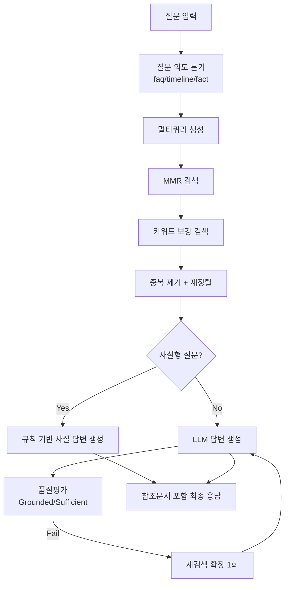

# W3_006 RAG 기술경험 참고문서

## 1) 문서 목적
- 이 문서는 `W3_006` 실습을 통해 확보한 기술을, 이후 프로젝트에서 바로 재사용할 수 있도록 정리한 기술 참조 문서입니다.
- `통합가이드`와 `과제제출설명`의 내용을 합쳐, 구현 근거, 이슈, 개선 전략, 운영 체크리스트까지 한 번에 보도록 구성했습니다.

## 2) 기준 참조 문서
1. `week3/W3_006_통합_가이드.md`
2. `week3/W3_006_과제제출_설명.md`
3. `week3/PRJ01_W3_006_Housing_FAQ_Chatbot_실습전용.ipynb`
4. `data/faq_data_er.md`
5. `data/er_histroy_year.md`

## 3) 이번 과제로 확보한 핵심 기술
1. RAG 기본 구조 구현
- 문서 로드 -> 문서 구조화 -> 임베딩 -> 벡터스토어 -> 검색 -> 답변 생성까지 end-to-end 구성.

2. 메타데이터 중심 설계
- `doc_type`, `year_text`, `country`, `scientist`, `source_file`, `topic` 등을 부여해 검색 제어 가능.

3. 검색 품질 보강 기법
- MMR 검색.
- 멀티쿼리 확장.
- 키워드 보강 검색.
- 재정렬(rerank)로 질문-문서 정합도 향상.

4. 답변 신뢰도 제어
- 사실형 질문(언제/무엇 발표 등)은 deterministic 경로로 우선 처리.
- 일반 질문은 LLM 생성 후 품질평가(grounded/sufficient)로 게이트.
- 품질 미달 시 1회 재검색/재생성.

5. 사용자 확인 가능성 강화
- 최종 응답에 참조문서 메타데이터를 항상 표시.

6. UI 통합
- Gradio ChatInterface로 대화형 검증/데모 가능 상태 구성.

## 4) 현재 기준 아키텍처

## 5) 데이터/메타데이터 설계 기준
1. FAQ 데이터
- 원본 형식: `Q: ...` / `A: ...`
- 문서화 형식: `[FAQ] 질문: ... 답변: ...`
- 필수 메타데이터: `doc_type=faq`, `question_id`, `source_file`, `topic`

2. Timeline 데이터
- 원본 형식: `연도 | 국가 | 과학자` + `성과: ...`
- 문서화 형식: `[TIMELINE] 시기/국가/과학자/성과`
- 필수 메타데이터: `doc_type=timeline`, `timeline_id`, `year_text`, `country`, `scientist`, `era_section`, `source_file`, `topic`

3. 설계 원칙
- 검색용 텍스트와 필터용 메타데이터를 분리.
- `doc_type`은 모든 후속 분기 로직의 기준이므로 누락 금지.
- 원본 파싱 오류(예: `Q:` 누락)는 인덱싱 품질 문제로 직결되므로 사전 검증 필수.

## 6) 검색 전략 운영 기준
1. 1차 검색
- MMR 기본 검색으로 다양성과 관련성 균형 확보.

2. 멀티쿼리 확장
- 질문 표현이 바뀌어도 후보 문서를 넓게 확보.
- 인물명/행위/시기 관련 변형 쿼리를 함께 사용.

3. 키워드 보강
- 벡터 유사도만으로 누락될 수 있는 인물 고유명사 케이스를 보완.

4. 재정렬(rerank)
- 질문 용어와 문서 메타데이터/본문 일치도를 점수화해 상위 후보 재배열.

5. 재시도 정책
- 품질평가 실패 시 `k`, `fetch_k` 등 검색 폭을 늘려 1회 재시도.
- 무한 재시도는 비용/지연 증가로 금지.

## 7) 답변 생성/평가 전략
1. 사실형 질문 우선 경로
- 질의 패턴이 명확한 fact 질문이면 timeline 근거 문서에서 직접 답변.
- 장점: 불필요한 생성 편차 감소, 정답 안정성 향상.

2. 일반 질문 경로
- `context + chat_history + question` 기반 LLM 생성.
- 품질평가 항목:
  - grounded: 답이 문서 근거에 맞는가
  - sufficient: 질문 요구를 충분히 충족하는가

3. 최종 응답 정책
- 항상 참조문서 목록 제공.
- 근거 부족 시 “근거 부족”을 명시하고 과잉 확답 금지.

## 8) 실제 이슈와 기술적 교훈
1. 검색 누락 이슈(대표: 코페르니쿠스 질의)
- 증상: 데이터에 존재하는 항목인데 비관련 문서가 참조됨.
- 교훈: 벡터 검색만으로는 고유명사/사실형 질의에 취약할 수 있음.
- 대응: 멀티쿼리 + 키워드 보강 + 재정렬 + fact deterministic 경로 조합.

2. 품질평가 과민 이슈
- 증상: 문서가 있는데도 grounded=False 판정.
- 교훈: 평가 체인은 보조 안전장치로 쓰고, 사실형은 직접 추출 로직이 더 안정적.

3. 데이터 파싱 품질 이슈
- 증상: FAQ 건수 불일치.
- 교훈: 원본 포맷 일관성 검증을 인덱싱 이전 단계에 넣어야 함.

## 9) 멀티RAG 적용 효과 정리
1. 효과 있었던 부분
- 질의 표현 다양성 대응.
- 1차 검색 누락 완화.

2. 단독 한계
- 오탈자/포맷 불량 데이터 문제는 해결 못함.
- 평가 체인 오판 문제를 완전히 제거하지 못함.

3. 결론
- 멀티RAG는 “필수 보강 요소”로 효과적.
- 그러나 데이터 품질 관리와 deterministic 로직이 함께 있어야 안정화됨.

## 10) 고도화 로드맵 (프로젝트 적용용)
1. 1단계: 안정화
- 인덱싱 사전검증: 파싱 건수/필수 필드 체크.
- 검색 로그 저장: 질문, 후보 top-k, 최종 선택 문서 기록.
- 실패 케이스셋(오답노트) 구축.

2. 2단계: 정확도 개선
- 질의 재작성(query rewrite) 체계화.
- BM25 + Vector 하이브리드 검색 도입 검토.
- Cross-encoder reranker 도입 검토.

3. 3단계: 사용자 경험 개선
- 사용자 수준(입문/중급)별 답변 깊이 제어.
- 추가 학습 추천(연표/인물 기반 추천 경로) 제공.
- 오답노트/복습 질문 생성 기능 연결.

4. 4단계: 운영/관측 고도화
- LangSmith/Langfuse로 프롬프트/체인 버전별 성능 추적.
- 질문 유형별 정확도 대시보드 운영.

## 11) 운영 체크리스트
1. 데이터
- FAQ/Timeline 파싱 건수 확인.
- 메타데이터 누락 필드 확인.

2. 검색
- 질문별 top-k 후보의 관련성 확인.
- doc_type 분기가 의도대로 동작하는지 확인.

3. 생성/평가
- fact 질문이 deterministic 경로로 들어가는지 확인.
- grounded/sufficient 실패 시 재시도 동작 확인.

4. UI/제출
- Gradio 정상 구동 확인.
- 참조문서 출력 형식 확인.
- 노트북 전체 순차 실행 재현성 확인.

## 12) 다음 프로젝트에서 재사용할 최소 템플릿
1. 데이터 계층
- `raw_data/*.md`
- `parse_*()` 함수
- `to_documents()` 함수

2. 검색 계층
- `retrieve_docs()`
- `retrieve_docs_multi()`
- `keyword_boost_docs()`
- `rerank_docs()`

3. 응답 계층
- `find_timeline_fact_doc()`
- `build_fact_answer_from_doc()`
- `chat_fn()`

4. 품질 계층
- `check_answer_quality()`
- 실패 재시도 정책 함수

---

이 문서는 과제 제출용 요약을 넘어서, 다음 RAG 프로젝트에서도 바로 복사해 적용 가능한 운영 기준 문서로 사용합니다.
