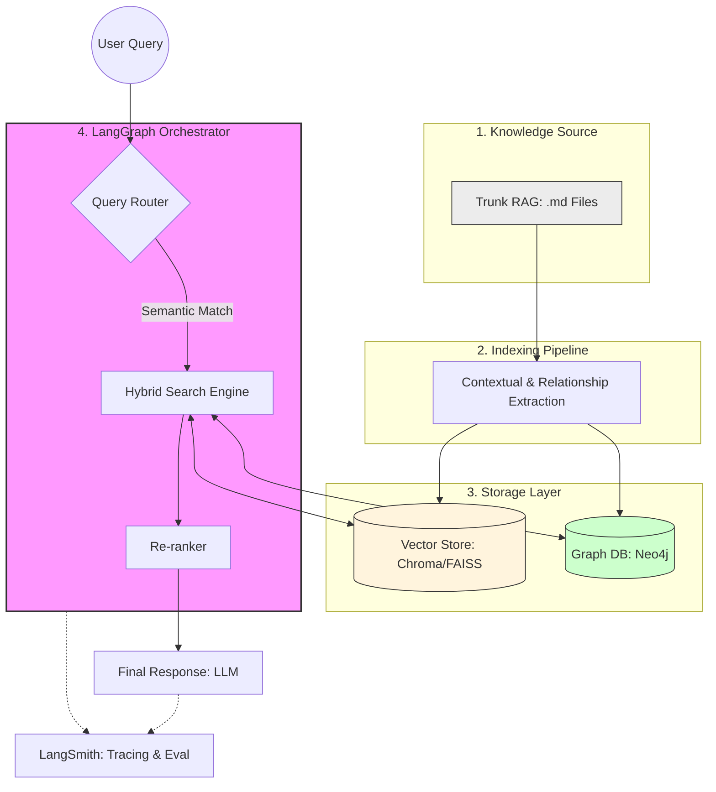

### 🏗️ 통합 RAG 시스템 아키텍처 설명

이 시스템은 기존의 단순 문서 검색(Vector)에 지식 간의 관계(Graph)를 결합하여, 더 정확하고 맥락이 풍부한 답변을 제공하도록 설계되었습니다.

#### 1. 지식 적재 단계 (Knowledge Ingestion Phase)

* **Trunk RAG (.md Files):** 팀 내에서 관리하는 마크다운 문서들이 원천 데이터가 됩니다.
* **Indexing Pipeline:** 문서를 자를 때(Chunking) 단순히 자르는 것이 아니라, **Contextual Retrieval** 기법을 사용하여 각 조각에 전체 문서의 요약 정보를 덧붙입니다.
* **이원화 저장:**
* **Vector Store:** 텍스트의 의미론적 유사성을 기반으로 저장합니다.
* **Graph DB (Neo4j):** 문서 내 핵심 개체(Entity)와 그들 간의 관계(Relationship)를 추출하여 연결된 지식 형태로 저장합니다.

#### 2. 검색 및 생성 단계 (Retrieval & Generation Phase)

* **LangGraph Orchestrator:** 시스템의 '두뇌' 역할을 하며 전체 흐름을 제어합니다.
* **Query Router:** 사용자의 질문을 분석하여 어떤 검색 방식이 최적인지 판단합니다.
* *예: "A 프로젝트 담당자가 누구야?" → Vector Search*
* *예: "A 프로젝트와 관련된 모든 기술 스택의 의존 관계를 알려줘" → Graph Search*

* **Hybrid Search:** 벡터 스토어의 의미 검색과 그래프 DB의 관계 검색 결과를 결합하여 가장 관련성 높은 정보를 모읍니다.
* **Re-ranker:** 수집된 정보들 중 답변에 가장 중요한 순서대로 정렬하여 LLM에게 전달합니다.

#### 3. 운영 및 평가 (Observability)

* **LangSmith:** 전체 과정(Trace)을 모니터링합니다. 어떤 단계에서 검색 품질이 떨어지는지, 비용은 얼마나 발생하는지 실시간으로 확인하고 평가하여 시스템을 지속적으로 고도화합니다.

이 구성을 통해 기존 Trunk RAG의 UI/UX를 유지하면서도, 내부적으로는 **지식의 연결성**을 극대화한 전문가 수준의 검색 솔루션을 구축할 수 있습니다.

### 🛠️ 구성도 주요 포인트 설명

1. **데이터 적재 (Ingestion):**
* 기존의 `.md` 파일을 단순히 텍스트로만 보는 것이 아니라, **Contextual Retrieval** 기법을 적용해 각 청크에 문서 전체의 맥락을 부여하고, 동시에 핵심 엔티티 간의 관계를 추출하여 **Graph DB**에 저장합니다.

2. **오케스트레이션 (LangGraph):**
* **Query Router:** 질문이 들어오면 "단순 정보 검색"인지 "관계 기반 추론"이 필요한지 판단하여 검색 경로를 지정합니다.
* **Hybrid Search:** 벡터의 유사도 검색 결과와 그래프의 연결 구조 검색 결과를 결합하여 답변의 정확도를 극대화합니다.

3. **성능 관리 (LangSmith):**
* 그래프 랭은 구조가 복잡한 만큼 디버깅이 중요합니다. 전체 검색 과정을 추적(Tracing)하여 어떤 노드에서 성능 병목이 생기는지 확인하고 지속적으로 최적화합니다.

이 구조는 기존 Trunk RAG의 문서 관리 편의성을 유지하면서도, 그래프 기술을 통해 지식 간의 '연결'을 강화하는 가장 효율적인 방식입니다.